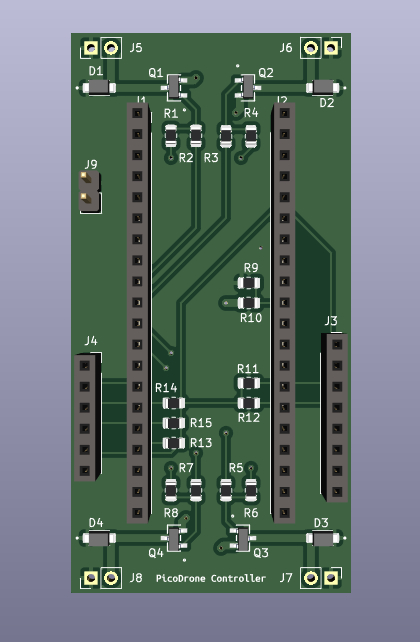
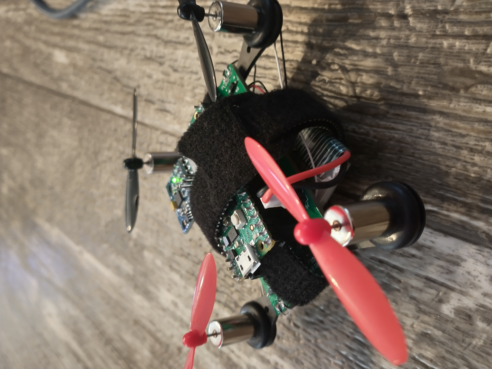

# Pico Quadcopter Drone

- `hardware/` contains the kicad schematic and pcb layout files 
    - qx95 drone frame
    - 8520 brushed motors
    - header sockets for raspberry pi pico
    - header sockets for mpu 6050 breakout board
    - header sockets for sd card spi breakout board (future use)

- `firmware/` contains the code for the microcontroller
	- requires pico_sdk to be downloaded and PICO_SDK_PATH to be set
    - requires freertos to be downloaded and FREERTOS_KERNEL_PATH to be set
    - uses `btstack` and bluetooth rfcomm to receive control commands over bluetooth connection

- `app/` contains python script to send inputs from ps4 controller to drone
    - install `pyPS4Controller` and `pySerial`
    - find pico_w bt addr using `sdptool browse`
    - run `rfcomm connect /dev/rfcomm0 <btaddr>` to connect to the drone
    - run `python3 main.py rfcomm0`
    - connect ps4 controller
        - `triangle` - increase pitch
        - `cross` - decrease pitch
        - `square` - roll left
        - `circle` - roll right
        - `up arrow` - increase throttle
        - `down arrow` - decrease throttle
        - `left arrow` - yaw left
        - `right arrow` - yaw right

## TODO
- assemble full system on frame to run and test
- image of assembled full system on frame
- need a filter or something for improved imu data
- need to test and adjust pid values
